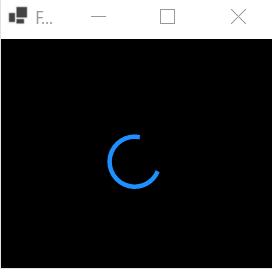

# Windows Forms でくるくるする

こんな感じでくるくるする処理を Windows Forms で実装します．



## 実装

[./KuruKuru/Form1.cs の Paint イベント](./KuruKuru/Form1.cs)

```csharp
    private void Form1_Paint(object sender, PaintEventArgs e)
    {
        // アンチエイリアス高画質
        e.Graphics.SmoothingMode = SmoothingMode.HighQuality;
        
        // 背景を黒で塗りつぶす
        e.Graphics.Clear(Color.Black);
        
        // くるくるの色・太さ
        using var pen = new Pen(Color.DodgerBlue, 4.5f);
        // くるくるの位置：フォームの中央
        var location = new PointF(ClientSize.Width / 2f, ClientSize.Height / 2f);
        // くるくるのサイズ：50x50
        var size = new SizeF(50, 50);
        // くるくるの周期
        var periodMs = 1400; // 1400ミリ秒
        
        // くるくるの描画
        DrawSpinner(e.Graphics, pen,  center, size, periodMs);
    }

    private void DrawSpinner(Graphics g, Pen pen, PointF center, SizeF size, int periodMs)
    {
        // 1回転の周期: 現在時刻を基準に 0～1に変換する
        double time = Environment.TickCount % periodMs / (double)(periodMs - 1);

        // 円弧の開始・終了：0～360度に変換．速度はイージング関数で調節
        // 参考: https://easings.net/ja
        double start = 360d * EaseOutCubic(time);
        double end = 360d * EaseInCubic(time);

        // 変形の状態を保存
        var savedTransform = g.Transform;

        // 指定された位置を中心に回転する
        var transform = new Matrix();
        transform.Translate(center.X, center.Y);
        transform.Rotate((float)(360d * time + 90d)); // 初期位置は90度
        g.Transform = transform;
        
        // 円弧を描画
        g.DrawArc(pen, -size.Width / 2, -size.Height / 2, size.Width, size.Height, (float)start, (float)(end - start));
        
        // 保存した変形の状態をもどす
        g.Transform = savedTransform;
    }
    
    // https://easings.net/ja#easeInCubic
    private double EaseInCubic(double t)
    {
        return Math.Pow(t, 3);
    }

    // https://easings.net/ja#easeOutCubic
    private double EaseOutCubic(double t)
    {
        return 1 - Math.Pow(1 - t, 3);
    }
```

